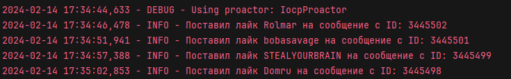

<br/>
<p align="center">
  <a href="https://github.com/llimonix/LOLZAutoLikes">
    
  </a>

  <h3 align="center">LOLZAutoLikes</h3>

  <p align="center">
    A script that automatically likes new posts in user profiles on the LOLZTEAM forum
    <br/>
    <br/>
    <a href="https://github.com/llimonix/LOLZAutoLikes/blob/main/README.md">RU README</a>
    .
    <a>EN README</a>
    .
  </p>
</p>

    

## Table Of Contents

* [About the Project](#about-the-project)
* [Getting Started](#getting-started)
  * [Installation](#installation)
* [License](#license)

## About The Project



> [!WARNING]
> This script is posted on GitHub for review. Using this script will block your profile on the forum. Do not use it in any case!

In this example script, you can see that cookies from the lolzteam forum are used, since the page where the latest profile messages appear is not in the official lolzteam forum API. 

You can see how cookies are used and how they are generated using the example of my script.

## Getting Started

Before you start, you must install python versions at least 3.11 from the official website www.python.org . Don't forget to check the Add to PATH box during installation.

### Installation

1. Download [archive](https://github.com/llimonix/LOLZAutoLikes/releases/latest) and unpack
2. Open a command prompt in the project directory or navigate to the desired path using the command

```
cd path/LOLZAutoLikes
```
3. Install the modules

```python
pip install -r requirements.txt
```

4. Enter your cookies and proxy (optional) in the `config.env` file

```
XF_USER=...
XF_TFA_TRUST=...
USER_AGENT=...
PROXY=user:pass@ip:port
PROXY_EXISTS=False
```

5. Run the main project file

```python
python main.py
```

## License

Distributed under the MIT License. See [LICENSE](https://github.com/llimonix/LOLZAutoLikes/blob/main/LICENSE) for more information.

