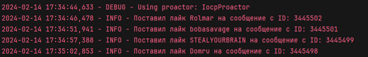

<br/>
<p align="center">
  <a href="https://github.com/llimonix/LOLZAutoLikes">
    
  </a>

  <h3 align="center">LOLZAutoLikes</h3>

  <p align="center">
    Скрипт который автоматически лайкает новые сообщения в профилях пользователей на форуме LOLZTEAM
    <br/>
    <br/>
    <a>RU README</a>
    .
    <a href="https://github.com/llimonix/LOLZAutoLikes/blob/main/README.en.md">EN README</a>
  </p>
</p>

    

## Cодержание

* [О проекте](#о-проекте)
* [Первоначальный запуск](#первоначальный-запуск)
  * [Установка](#установка)
* [Лицензия](#лицензия)

## О проекте



> [!WARNING]
> Этот скрипт размещен на GitHub для ознакомления. Использование этого скрипта приведет к блокировке вашего профиля на форуме. Ни в коем случае не используйте его!

В этом примере скрипта вы можете видеть, что используются файлы cookie с форума lolzteam, поскольку страница, на которой отображаются последние сообщения профиля, отсутствует в официальном API форума lolzteam. 

Вы можете увидеть, как используются файлы cookie и как они генерируются, на примере моего скрипта.

## Первоначальный запуск

Перед началом работы вы должны установить python версии не ниже 3.11 с официального веб-сайта www.python.org . Не забудьте установить флажок Add to PATH во время установки.

### Установка

1. Скачайте [архив](https://github.com/llimonix/LOLZAutoLikes/releases/latest) и распакуйте
2. Откройте командную строку в папке проекта или перейдите по нужному пути с помощью команды

```
cd path/LOLZAutoLikes
```
3. Установите необходимые модули

```python
pip install -r requirements.txt
```

4. Введите ваши файлы cookie и прокси (необязательно) в файле `config.env`

```
XF_USER=...
XF_TFA_TRUST=...
USER_AGENT=...
PROXY=user:pass@ip:port
PROXY_EXISTS=False
```

5. Запустите основной файл проекта

```python
python main.py
```

## Лицензия

Распространяется по лицензии MIT. Дополнительную информацию смотрите в разделе [ЛИЦЕНЗИЯ](https://github.com/llimonix/LOLZAutoLikes/blob/main/LICENSE).
